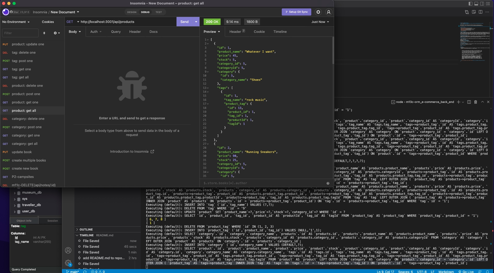

# m13c-orm_e-commerce_back_end
# 
# Date: 16/10/2022, 12:14:37 pm

## GutHub Repo URL: https://github.com/PatrickARatcliff/m13c-orm_e-commerce_back_end
## Demo-Video URL: https://drive.google.com/file/d/1rIw6wGzeB2fiCAmgxc0R9JzDpeS9LvpK/view

  
## Table of Contents
- [Project Description](#project-description)
- [Installation Instructions](#installation-instructions)
- [Usage Information](#usage-information)
- [Contribution Guidelines](#contribution-guidelines)
- [Test Instructions](#test-instructions)
- [License](#license)
  
## Project Description
- GIVEN a functional Express.js API, WHEN I add my database name, MySQL username, and MySQL password to an environment variable file, THEN I am able to connect to a database using Sequelize. WHEN I enter schema and seed commands, THEN a development database is created and is seeded with test data. WHEN I enter the command to invoke the application, THEN my server is started and the Sequelize models are synced to the MySQL database. WHEN I open API GET routes in Insomnia for categories, products, or tags, THEN the data for each of these routes is displayed in a formatted JSON. WHEN I test API POST, PUT, and DELETE routes in Insomnia, THEN I am able to successfully create, update, and delete data in my database.
  
## Installation Instructions
- This application requires "dotenv": "^8.2.0","express": "^4.17.1","mysql2": "^2.1.0","sequelize": "^5.21.7". Simply copy the the repo and run "npm i" command from your integrated terminal. You should see the node modules directory populate under the repo used for the integrated terminal. Using mySQL run schema.sql from the db folder, exit, and enter “run npm seed” from your terminal.
  
## Usage Information
- To use, simply open m13c-orm_e-commerce_back_end directory with the integrated terminal/bash. Create a .env file in the directory, enter: 

DB_NAME='ecommerce_db’ 
DB_USER=‘<your mysql username>’ 
DB_PASSWORD=‘<your mysql password>' 

In the terminal type the command “npm run watch”  or “npm run start”. When the server is running you can create, read, update and delete data from the e-commerce database.
  
## Contribution Guidelines
- To contribute to this project, fork the repository at ‘https://github.com/PatrickARatcliff/m13c-orm_e-commerce_back_end',create a pull request with a description for the change and its location.
  
## Test Instructions
- N/A
    
## License
- MIT License
- m13c-orm_e-commerce_back_end: Back end for an e-commerce site, configures a working Express.js API to use Sequelize to interact with a MySQL database..
- Copyright (c) [2022] [Patrick Ratcliff]. All rights reserved.

    

      Permission is hereby granted, free of charge, to any person obtaining a copy
      of this software and associated documentation files (the "Software"), to deal
      in the Software without restriction, including without limitation the rights
      to use, copy, modify, merge, publish, distribute, sublicense, and/or sell
      copies of the Software, and to permit persons to whom the Software is
      furnished to do so, subject to the following conditions:

      The above copyright notice and this permission notice shall be included in all
      copies or substantial portions of the Software.

      THE SOFTWARE IS PROVIDED "AS IS", WITHOUT WARRANTY OF ANY KIND, EXPRESS OR
      IMPLIED, INCLUDING BUT NOT LIMITED TO THE WARRANTIES OF MERCHANTABILITY,
      FITNESS FOR A PARTICULAR PURPOSE AND NONINFRINGEMENT. IN NO EVENT SHALL THE
      AUTHORS OR COPYRIGHT HOLDERS BE LIABLE FOR ANY CLAIM, DAMAGES OR OTHER
      LIABILITY, WHETHER IN AN ACTION OF CONTRACT, TORT OR OTHERWISE, ARISING FROM,
      OUT OF OR IN CONNECTION WITH THE SOFTWARE OR THE USE OR OTHER DEALINGS IN THE
      SOFTWARE.

    
***[This is an external link to the MIT license](https://en.wikipedia.org/wiki/MIT_License)***
  
---
